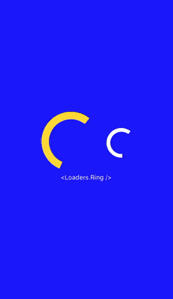

# react-native-pure-loaders

React native loading spinners based on the ones found at [https://loading.io/css/](https://loading.io/css/).

Currently, the only loaders are <Loader.Ring> and <Loaders.Ellipses>. They can be seen below in the Demo.

## Demo



## Installation

`npm install react-native-pure-loaders`

or

`yarn add react-native-pure-loaders`

## Usage

Example usage:

```js
import Loaders from './lib/index';

export default function App() {
  return (
    <View style={styles.container}
      <Loaders.Ring />
    </View>
  );
}
```

## API

### Loaders.Ellipses

**props**

- *color*: string - The color of the loader.
- *size*: number - The size of the loader icon. Defaults to 64.

### Loaders.Ring

**props**

- *color*: string - The color of the loader.
- *size*: number - The size of the loader icon. Defaults to 64.